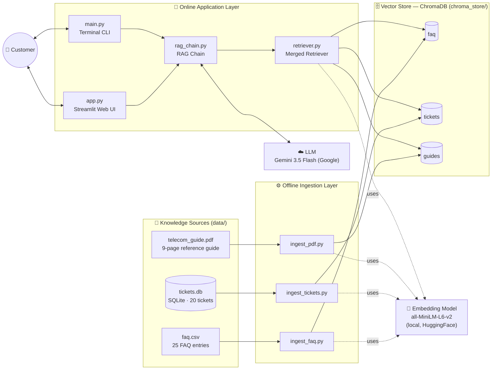
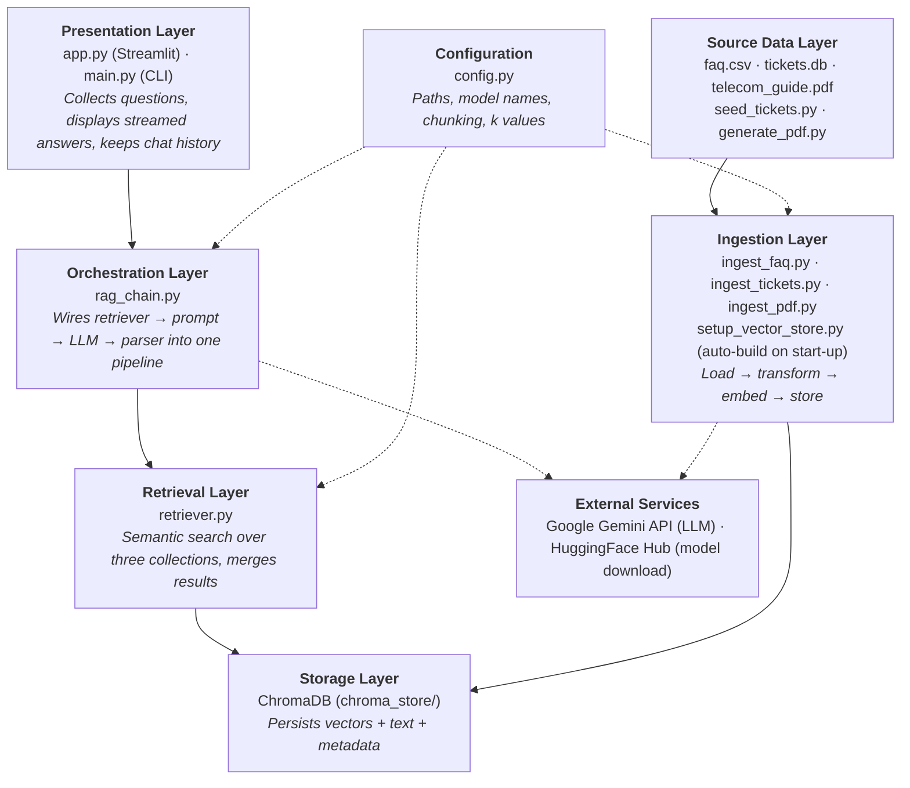
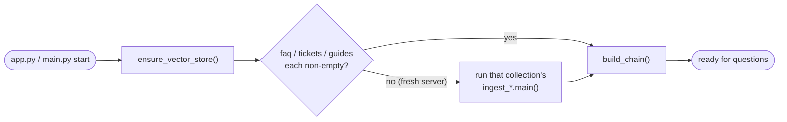
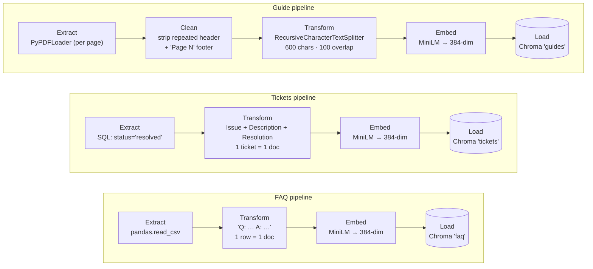
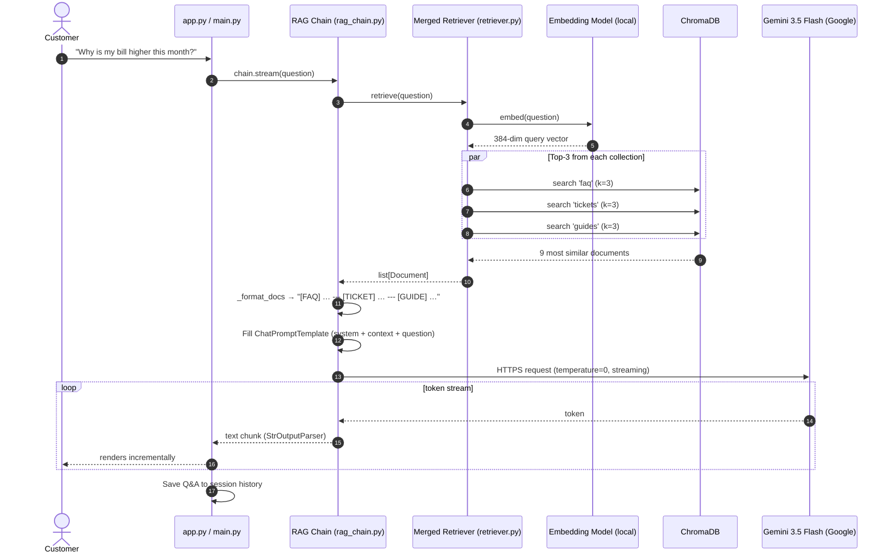
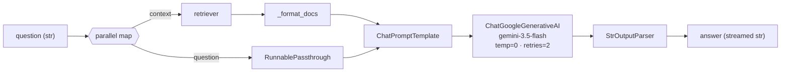
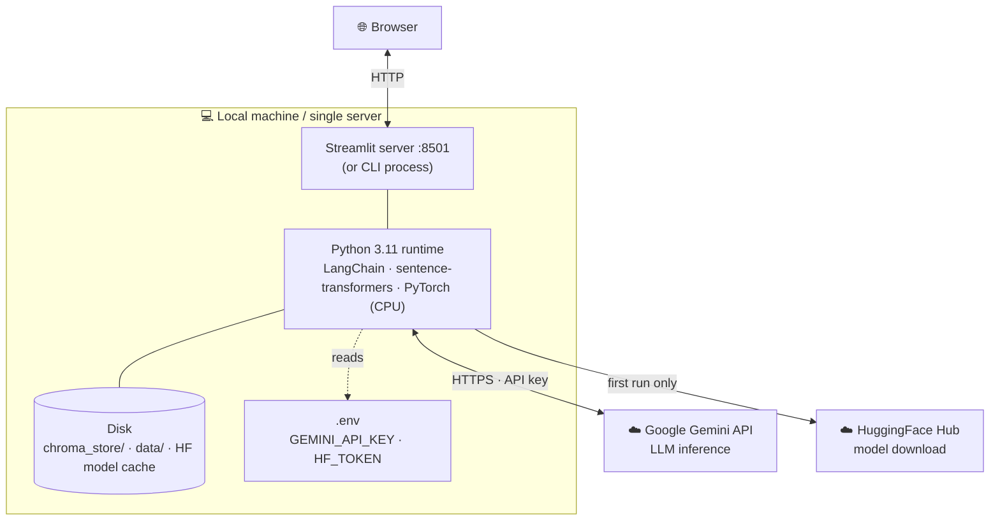
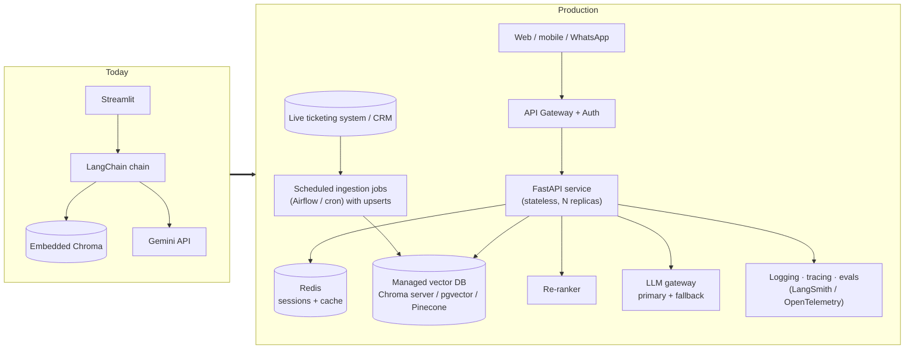

# Architecture — RAG Telecom Customer Care Chatbot

This document describes the system architecture and design of the telecom support chatbot: its components, how data flows through it, and the design decisions behind it.

> Diagrams use [Mermaid](https://mermaid.js.org/). They render on GitHub and in VS Code (with the *Markdown Preview Mermaid Support* extension).

---

## 1. System Overview

The chatbot is a **Retrieval-Augmented Generation (RAG)** application. Instead of relying only on what a Large Language Model (LLM) already knows, it first **retrieves** relevant facts from the company's own knowledge sources and then asks the LLM to **generate** an answer grounded in those facts.

The system has two independent pipelines:

| Pipeline | When it runs | What it does |
|---|---|---|
| **Offline ingestion pipeline** | Once, and whenever source data changes | Reads raw knowledge (CSV, SQLite, PDF), converts it to vector embeddings, stores them in ChromaDB |
| **Online query pipeline** | Every time a user asks a question | Embeds the question, retrieves matching knowledge, builds a prompt, calls the LLM, streams the answer back |

### High-level architecture



---

## 2. Layered Architecture

Like most production systems, the project is organised into layers, each with one responsibility. A layer only talks to the layer directly below it.



| Layer | Files | Responsibility | Technology |
|---|---|---|---|
| Presentation | `app.py`, `main.py` | User interaction | Streamlit, Python `input()` |
| Orchestration | `rag_chain.py` | Pipeline composition, prompt engineering | LangChain LCEL |
| Retrieval | `retriever.py` | Similarity search & result merging | LangChain + Chroma |
| Storage | `chroma_store/` | Vector persistence | ChromaDB (SQLite-backed) |
| Ingestion | `ingest_*.py` | ETL into vector store | pandas, sqlite3, PyPDF, text splitters |
| Source data | `data/` | Raw knowledge | CSV, SQLite, PDF (fpdf2) |
| External | — | Inference & model hosting | Google Gemini API, HuggingFace |
| Configuration (cross-cutting) | `config.py` | Single source of truth for paths, collection names, embedding/LLM models, chunking and k values | Python `pathlib` |

---

## 3. Offline Ingestion Pipeline

Each knowledge source has its own ingestion script following the classic **ETL (Extract → Transform → Load)** pattern.

Every run is **idempotent**: before loading, the script deletes all existing vectors in its own collection, then adds the fresh set. Re-running a script therefore replaces its data rather than duplicating it, and never touches the other two collections. The collection is emptied in place (not dropped), so ChromaDB keeps reusing the same on-disk index folder.

### Start-up bootstrap

`chroma_store/` is git-ignored, so a fresh clone or server starts with no vectors. Both entry points call `ensure_vector_store()` (`setup_vector_store.py`) before building the chain. It reads each collection's size directly from ChromaDB and runs the ingest script only for collections that are **missing or empty**.



| Situation | Cost |
|---|---|
| Fresh server (no `chroma_store/`) | All three ingests run once: about a minute, behind a "Preparing the knowledge base" spinner |
| Normal restart | Three `count()` calls: milliseconds |
| Source data changed | **Not detected** (collections aren't empty). Re-run the matching ingest script manually |



### Chunking strategy per source

| Source | Chunking | Why |
|---|---|---|
| FAQ | None — one row is one document | Each Q&A is short and self-contained |
| Tickets | None — one ticket is one document | A ticket's issue and resolution must stay together to be useful |
| PDF guide | Header/footer stripped, then 600-char chunks, 100-char overlap, split on `\n\n` → `\n` → `.` → space | Pages are long; small chunks give precise matches, and overlap prevents a sentence being cut in half across chunks. Removing the repeated page header and "Page N" footer keeps boilerplate out of the embeddings |

### Metadata stored with each vector

| Collection | Metadata fields |
|---|---|
| `faq` | `source="faq"`, `category`, `faq_id` |
| `tickets` | `source="ticket"`, `ticket_id`, `category`, `status` |
| `guides` | `source="guide"`, `chunk_index`, `page`, plus PDF loader fields |

The `source` field is later used to label each piece of context in the prompt (e.g. `[FAQ]`, `[TICKET]`, `[GUIDE]`).

---

## 4. Online Query Pipeline (Request Lifecycle)

This sequence shows what happens from the moment a customer presses Enter until the answer appears.



> Note: in the current code the three collection searches run one after another; they are drawn as `par` because they are independent and could be parallelised.

### The RAG chain (LangChain Expression Language)



Code equivalent (`rag_chain.py`):

```python
chain = (
    {"context": retriever | _format_docs, "question": RunnablePassthrough()}
    | prompt
    | llm
    | StrOutputParser()
)
```

---

## 5. Deployment View

Everything runs on a single machine except LLM inference.



| Concern | Where it lives |
|---|---|
| Secrets | `.env` (git-ignored); template in `.env.example` |
| Vector data | `chroma_store/` — a local SQLite file plus binary index folders; built automatically on first start-up (`setup_vector_store.py`) |
| Embedding model | Downloaded once to the HuggingFace cache, then runs locally on CPU |
| LLM | Remote — Google Gemini API (`langchain-google-genai`) |
| Dependencies | `pyproject.toml` + `uv.lock` (managed by `uv`); `requirements.txt` exported for `pip` / hosting platforms. PyTorch pinned to the **CPU-only** build (no CUDA/NVIDIA packages); `torchvision` not used |
| SQLite compatibility | ChromaDB needs SQLite ≥ 3.35. `sqlite_compat.py` (imported before ChromaDB everywhere) swaps in `pysqlite3-binary` only when the system SQLite is older; the package is installed on Linux x86_64 only |
| Settings | `config.py`; all paths are absolute, built from the project folder, so scripts run from any working directory |

---

## 6. Key Design Decisions

| # | Decision | Rationale | Trade-off |
|---|---|---|---|
| 1 | **RAG instead of fine-tuning** | Knowledge can be updated by re-running an ingest script — no model retraining | Answer quality depends on retrieval quality |
| 2 | **Three separate collections** instead of one | Guarantees every answer sees FAQ, ticket *and* guide context; prevents the numerous PDF chunks from crowding out FAQs | Always returns 9 docs, even if some are irrelevant |
| 3 | **Fixed k=3 per collection** | Simple, predictable prompt size | No relevance threshold or re-ranking |
| 4 | **Local embeddings (MiniLM-L6-v2)** | Free, fast on CPU, no data leaves the machine at embed time | Smaller model → lower semantic accuracy than large API embedders |
| 5 | **Hosted LLM: Gemini 3.5 Flash** (replaced Qwen on Groq) | Free tier, no GPU needed locally, and reachable from Streamlit Community Cloud. Groq returned *403 Access denied* from that platform's servers; the Groq code is kept commented out in `rag_chain.py` for switching back | Requires internet + API key; question and context are sent to a third party; free-tier rate limits, and the newest models can return *503 high demand* |
| 6 | **`temperature=0`** | Deterministic, factual support answers | Less varied phrasing |
| 7 | **Grounding prompt ("use ONLY the context")** with 611 fallback | Reduces hallucination; safe escalation path | May refuse questions it could have answered generally |
| 8 | **Streaming output** | Better perceived latency | Slightly more complex UI code |
| 9 | **Only `resolved` tickets ingested** | Escalated/unresolved tickets have no reliable fix to recommend | Loses signal from open cases |
| 10 | **Shared chain via `@st.cache_resource`** | Embedding model and DB connections are loaded once per server, not per message | Changes to the vector store require an app restart |
| 11 | **Two front-ends over one chain** | UI and CLI reuse identical logic (`build_chain()`) | — |
| 12 | **Central `config.py`** | One definition of the embedding model guarantees ingestion and retrieval always match; tuning needs one edit | Settings are code, not environment variables, so changing them means editing a file |
| 13 | **Clean PDF text before chunking** | Repeated headers/footers carry no meaning and blur chunk embeddings | Patterns are specific to this PDF's layout |
| 14 | **Build the vector store on start-up instead of committing it** | Keeps binary database files out of git; any fresh server self-initialises | First start on a new server is ~1 minute slower; changed source data still needs a manual re-ingest |
| 15 | **CPU-only PyTorch** | Removes several GB of CUDA libraries; fits free hosting tiers; the small embedding model runs fine on CPU | Can't use a GPU without changing the dependency pin |
| 16 | **Conditional SQLite shim** | Lets ChromaDB run on older Linux images without code changes per platform | One extra import that must precede ChromaDB in every entry point |

---

## 7. Non-Functional Characteristics

| Quality | Current state |
|---|---|
| **Latency** | Retrieval is local and fast (ms); total time dominated by Gemini generation, hidden by streaming |
| **Scalability** | Single-process; ChromaDB embedded mode. Suitable for a demo / small team |
| **Reliability** | LLM calls retry up to 2 times; no fallback model |
| **Security** | API keys in `.env`; no user authentication; no input sanitisation or PII filtering |
| **Observability** | Console prints during ingestion only; no logging/tracing at query time |
| **Memory** | Chat history is shown in the UI but **not** sent to the LLM — each question is answered independently |

---

## 8. Known Limitations & Evolution Path

**Current limitations**

- No conversation memory — follow-up questions like "and how do I fix that?" lose context.
- No evaluation suite to measure answer quality.

**How a production version would evolve**



| Area | Improvement |
|---|---|
| Ingestion | Incremental upserts with deterministic IDs (today each run fully reloads its collection); scheduled sync from the live ticketing system |
| Retrieval | Hybrid search (keyword + vector), similarity threshold, cross-encoder re-ranking |
| Conversation | Pass chat history and rewrite follow-up questions into standalone queries |
| Answers | Show source citations (ticket ID, FAQ ID, guide page) to the user |
| Service | Split UI from a FastAPI backend; containerise with Docker |
| Safety | PII redaction, prompt-injection guards, rate limiting, authentication |
| Quality | Offline evaluation set (question → expected answer) run on every change |
